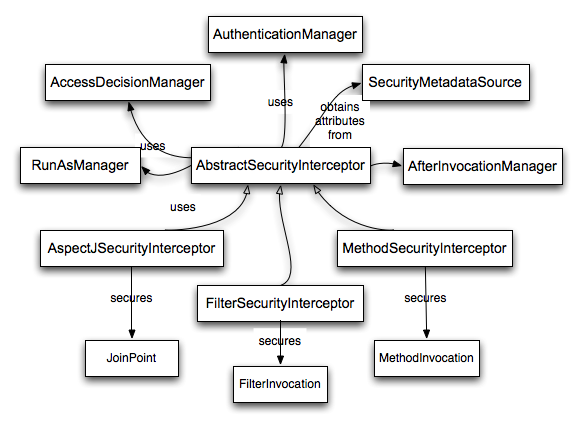

### 9.5 Spring Security中的访问控制（授权）

Spring Security中负责做访问控制判定的主要的接口是`AccessDecisionManager`。它具有一个判定方法，该判定方法接收一个`Authentication`的对象，该对象代表了一个发起访问请求的`principal`。还有一个"安全的对象"（参见下面），以及一个用于对象的安全元属性的列表（例如给访问进行授权所需要的角色列表）。

#### 9.5.1 安全与AOP通知（advice）

如果你熟悉AOP，那么你一定知道几种可用的通知类型：before，after，throws和around。around通知非常有用，因为advisor可以选择是否处理一个方法调用，是否改变response，还有是否要抛出一个异常。Spring Security为诸如web请求这类的方法调用提供一个around通知。我们使用标准的Spring AOP支持来实现方法调用的around通知，我们使用标准的过滤器来实现web请求的around通知。

如果你不熟悉AOP，关键点在于理解Spring Security能够帮助你保护例如web请求这类的方法调用。很多人都对在服务层保护方法调用很感兴趣。因为在当代Java EE应用中，服务层具有最多的业务逻辑。如果你只需要在服务层保护方法调用，Spring的标准AOP就足够了。如果你需要直接保护领域对象，那么你需要使用像是AspectJ这样的工具。

你可以选择使用AspectJ或是Spring AOP来执行方法授权，或者你可以选择使用过滤器来操作web请求授权。你还可以任意组合它们。主流的使用模式是操作一些web请求授权，在服务层再结合一些Spring AOP方法调用授权。

#### 9.5.2 安全对象和AbstractSecurityInterceptor

什么是安全的对象呢？Spring Security把任何具备了安全性（例如授权判定)的对象叫做安全对象。最通用的例子是方法调用和web请求。

每个被支持的安全的对象类型拥有自己的拦截器类，它们都是`AbstractSecurityInterceptor`的子类。通过适时的调用`AbstractSecurityInterceptor`非常重要，如果principal已经被认证，那么`SecurityContextHolder`会包含一个有效的`Authentication`。

`AbstractSecurityInterceptor`提供一个一致的工作流来操作安全对象请求，通常是：

1. 为上送的请求查找适当的配置属性
2. 提交安全对象、当前的`Authentication`和配置属性到`AccessDecisionManager`，从而进行授权判定
3. 可以改变`Authentication`的调用方式
4. 允许调用安全对象进行处理（假设访问被授权）
5. 一旦调用被返回，如果配置了`AfterInvocationManager`，那么调用它。如果调用过程抛出了一个异常，那么`AfterInvocationManager`不会被调用。
6. 

##### 什么是配置属性

配置属性可以接收一个字符串，该字符串对通过`AbstractSecurityInterceptor`使用的类具有一些特殊的意思。它们由框架里的接口`ConfigAttribute`表示。它们可以是简单的角色名，或者具有更复杂的意义，并根据`AccessDecisionManager`实现的不同而不同。`AbstractSecurityInterceptor`被和一个`SecurityMetadataSource`配置到一起，后者用来为安全对象查找属性。通常这些配置会对用户隐藏。配置属性可以注解到被保护的方法上，或者作为访问属性应用在被保护的URLs上。例如，当我们在命名空间描述中看到一些类似于 `<intercept-url pattern='/secure/**' access='ROLE_A,ROLE_B'/>`的内容，这表示要将 ROLE_A 和 ROLE_B 这两个配置属性应用到给定的pattern上。事实上，通过默认的`AccessDecisionManager`配置，任何具有一个`GrantedAuthority`并且匹配上述二者其中之一的人都能够被允许访问。严格来讲，它们只是属性，解析依赖于`AccessDecisionManager`的实现。标记前缀“ROLE_”用于表明这一属性是角色，并且应该被Spring Security的`RoleVoter`消费。当基于voter的`AccessDecisionManager`被使用时，这是唯一相关联的。我们可以在授权章节看到`AccessDecisionManager`如何被实现。

##### RunAsManager

假如`AccessDecisionManager`决定允许请求，`AbstractSecurityInterceptor`通常会继续请求。话虽如此，依然有极少的一些用户想要用一个不同的`Authentication`来替换`SecurityContext`中的`Authentication`，前者通过`AccessDecisionManager`调用`RunAsManager`来操作。这可能在某些适合的情况下很有用，例如当一个服务层方法需要调用一个远程系统并且提供一个不一样的凭证时。因为Spring Security会自动的从一个服务器向另一个服务器传递安全凭证（假设你正在使用一个经过适当配置的RMI或者HttpInvoker远程协议客户端），这可能非常有用！

##### AfterInvocationManager

随着安全对象调用过程的返回 - 它们可能意味着一个方法调用完成或者一个过滤器链处理完成 - `AbstractSecurityInterceptor`会得到一个最后的机会去操作调用过程。在这一阶段，`AbstractSecurityInterceptor`可能会对改变返回的对象有所兴趣。我们可能希望能够这样做，因为授权判定无法被以唯一的方式进行安全对象的调用。还有更高的扩展性，如果需要的话，`AbstractSecurityInterceptor`会将控制传递到一个`AfterInvocationManager`，从而改变该对象。这个类甚至可以完全地替换该对象，或者抛出一个异常，或者不改变它，你可以做你任何想做的事。事后调用检查只会在调用过程成功事被执行。如果抛出了异常，那么附加的检查会被跳过。

`AbstractSecurityInterceptor`和它的相关对象在《图9.1 安全拦截器与安全对象模块》可以查看详情。

**图9.1. 安全拦截器和安全对象模块**  

##### 集成安全对象模块

只有在开发者考虑整个拦截与授权请求的新的方式时，才需要去直接使用安全对象。例如，可能要构建一个新的安全对象去保护对一个消息系统的调用。需要安全性的任何事物都要提供一种拦截调用的方式（例如AOP around通知语义），它能够用于一个安全对象。话虽如此，大部分Spring应用只需要简单的使用目前支持的三种安全对象类型（AOP Alliance MethodInvocation，AspectJ JoinPoint和web请求FilterInvocation）来透明地完成。

